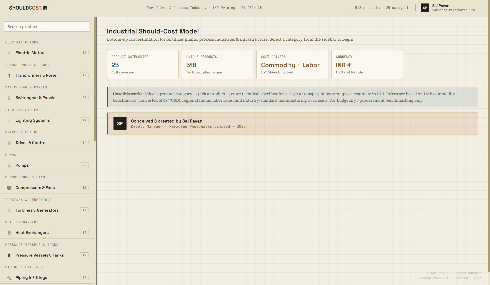
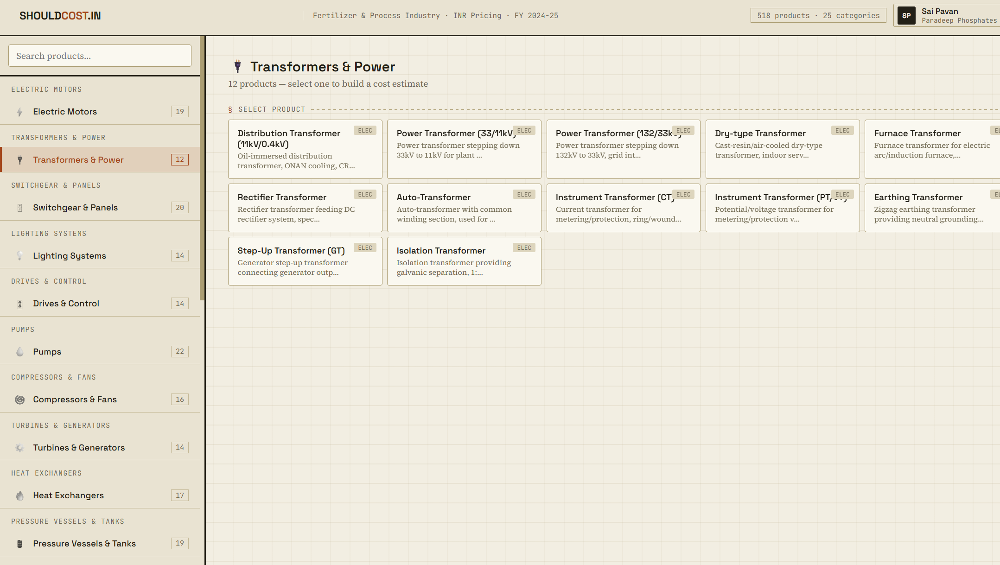
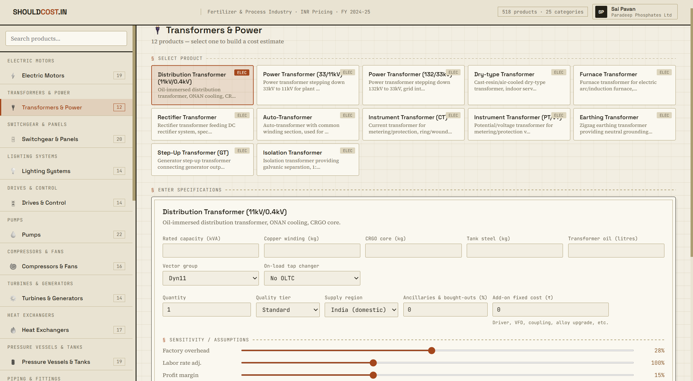
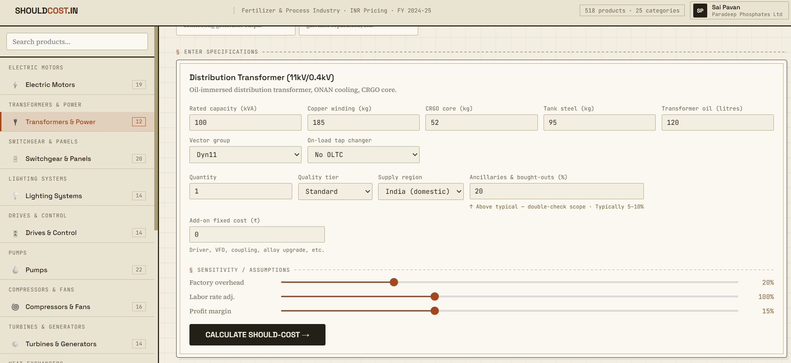
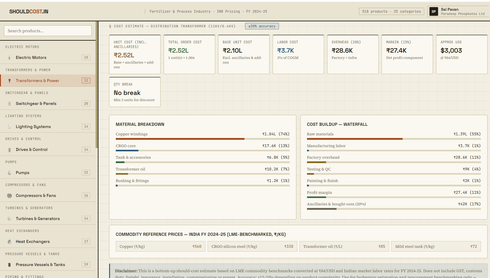
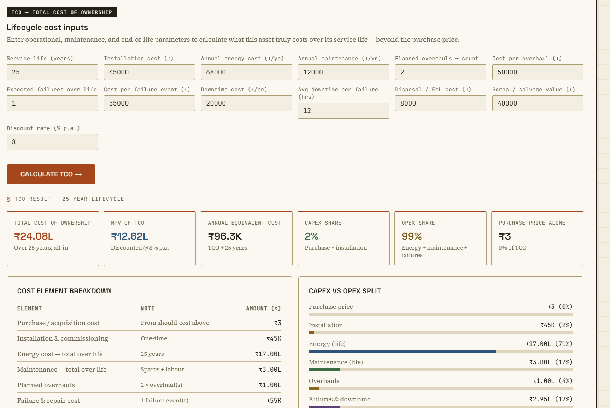

# Should-Cost Tool — Process Industry (Fertilizers & Beyond)

> *"In procurement, the one who knows the cost holds the leverage."*

---

## What This Is

A bottom-up **Should-Cost + Total Cost of Ownership (TCO)** estimation tool built specifically for process industries — fertilizers, chemicals, utilities, and heavy manufacturing.

Most procurement teams negotiate on vendor-quoted prices with no independent cost reference. This tool changes that.

---

## The Problem It Solves

Process plants run on thousands of items — from a ₹50 bolt to a ₹2 crore turbine. Vendor prices vary wildly. Without a cost foundation, buyers negotiate blind.

This tool gives procurement teams:
- A **should-cost price** built from raw materials, labor, overheads, and margin
- A **TCO view** that looks beyond purchase price — energy, maintenance, failures, downtime, and end-of-life over the asset's full service life

> *A 100 KVA distribution transformer costs ₹2.5 lakh to buy and ₹24 lakh to own. Energy losses alone are 71% of TCO over 25 years. This tool makes that visible before the purchase order is raised.*

---

## What's Inside

| Feature | Detail |
|---|---|
| Product coverage | 518 products across 25 categories |
| Cost methodology | Bottom-up: material + labor + overhead + margin |
| Commodity pricing | LME-benchmarked, INR, FY 2024-25 |
| Categories | Pumps, compressors, turbines, motors, valves, heat exchangers, electrical, instrumentation, piping, civil, and more |
| **Manpower tiers** | Tier 1, Tier 2, Tier 3 cities + Global — labor rates adjust automatically by location |
| **Variable cost fields** | Ancillaries & bought-outs (%) + add-on fixed cost (₹) — fully configurable per product |
| **Sensitivity sliders** | Factory overhead %, labor rate adjustment, profit margin — adjustable in real time |
| TCO module | 13 inputs — installation, energy, maintenance, overhauls, failures, downtime, disposal, salvage, NPV |
| Region adjustment | India domestic, China, EU, North America sourcing multipliers |
| Quality tiers | Economy / Standard / Premium / OEM |
| Output | Should-cost envelope, cost waterfall, material breakdown, CAPEX vs OPEX split, NPV, annual equivalent cost |

---

## Manpower City Tier Logic

Labor is not uniform across India. A fitter in Goa costs more than a fitter in West Bengal. This tool accounts for that.

| Tier | Cities / Context | Labor index |
|---|---|---|
| Tier 1 | Mumbai, Delhi, Chennai, Bengaluru, Hyderabad | Highest |
| Tier 2 | Ahmedabad, Pune, Kochi, Bhubaneswar, Nagpur | Moderate |
| Tier 3 | Smaller industrial towns, rural manufacturing clusters | Lower |
| Global | China, EU, North America | Region-specific multipliers |

This makes the tool usable for **multi-location sourcing comparisons** — not just a single plant benchmark.

---

## Variable Cost Logic

Two fields allow buyers to customise beyond the base model:

- **Ancillaries & bought-outs (%)** — accounts for components sourced externally by the manufacturer (bushings, relays, instruments, seals, couplings). Entered as a % of base cost. Typically 5–20% depending on product complexity.
- **Add-on fixed cost (₹)** — for known extras: special coatings, witness inspection, third-party testing, expediting fees, or any scope addition not in the base spec.

Together these ensure the should-cost reflects **actual scope** — not just a textbook estimate.

---

## Screenshots

> ⚠️ The full tool is proprietary. Screenshots below demonstrate capability.

**Welcome screen — 25 categories, 518 products**


**Transformers & Power — 12 product types**


**Distribution Transformer selected — specification inputs**


**100 KVA transformer — specs filled with sensitivity sliders**


**Should-cost result — material breakdown + cost waterfall**


**TCO — 25-year lifecycle, ₹24L total ownership cost, energy 71% of TCO**


---

## Methodology

```
Should-Cost = Raw Materials + Ancillaries & Bought-outs + Manufacturing Labor 
            + Factory Overhead + Testing & QC + Painting + Profit Margin 
            + Add-on Fixed Costs
```

Material prices indexed to **LME commodity benchmarks** at ₹84/USD. Labor rates segmented by Tier 1 / Tier 2 / Tier 3 / Global. Overhead, margin, and labor adjustable via sensitivity sliders.

---

## Why This Matters in Procurement

Should-cost modeling is standard practice in automotive and aerospace. In process industries — fertilizers, petrochemicals, power — it is almost entirely absent at the buyer level.

A procurement professional who walks into a negotiation knowing the **cost to manufacture**, the **cost of local labor**, and the **cost to own over 25 years** is negotiating from knowledge, not hope.

This tool is a step toward making that the norm.

---

## About the Creator

**Sai Pavan**
Deputy Manager — Procurement
Paradeep Phosphates Limited

CPSM® certified | 10 years in process industry procurement | SAP MM | AI tools | Digital fluency

Building at the intersection of sustainable procurement, cost intelligence, and data analytics.

This is part of a larger portfolio — **CradleToContract** — covering Should-Cost, EPD & LCA, Social LCA, KNIME analytics, and AI-integrated procurement tools.

🔗 [LinkedIn — Sai Pavan](https://www.linkedin.com/in/sai-pavan-cpsm%C2%AE-7a1806135/)

---

## Disclaimer

This tool is for **budgetary estimation and procurement benchmarking only**. Accuracy: ±15–25% depending on product complexity. Does not include GST, customs duty, freight, or insurance. Obtain competitive quotations for actual procurement decisions.

---

*© 2025 Sai Pavan · Paradeep Phosphates Limited · Unauthorised redistribution without attribution is discouraged.*
